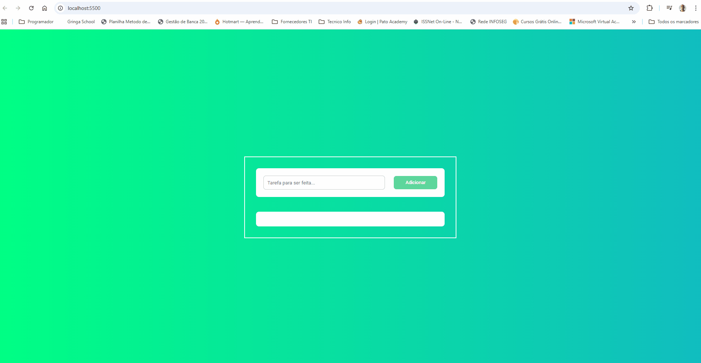

# 📋 ToDo List – Projeto FullstackClub2

Uma aplicação de lista de tarefas (ToDo List) desenvolvida com HTML, CSS e JavaScript no frontend e estruturada como projeto full-stack para prática de manipulação do DOM, eventos e organização de código.
Este repositório contém os arquivos fontes do projeto de frontend, incluindo scripts JS e assets estáticos. 

# 🚀 Visão Geral

Esse projeto permite ao usuário:

✔ Adicionar tarefas
✔ Exibir lista dinâmica de tarefas
✔ Manipular tarefas com JavaScript
✔ Utilizar boas práticas com addEventListener, Event Delegation e criação dinâmica de elementos

---

## 🔗 Demo Online

👉 [Clique aqui para ver o projeto funcionando](https://andredantasti.github.io/list-tasks-fullstackClub2/)

---

## 🎞️ Preview (GIF Demonstrativo)

### Screenshot

---

## 🛠️ Tecnologias

- HTML5
- CSS3 (Responsivo / Mobile First)
- JavaScript (fetch com JSON local)
- Git & GitHub
- GitHub Pages (para deploy)

---

## 🧠 Conceitos Aplicados

Este projeto foi criado para reforçar conhecimentos de:

    Manipulação de DOM com querySelector

    Eventos com addEventListener

    Criação e remoção dinâmica de elementos

    Boas práticas de código em JavaScript

---

## 🚩 Funcionalidades

O projeto implementa:

✔ Inserção de tarefas via formulário
✔ Evita adicionar tarefas vazias
✔ Uso de createElement para adicionar conteúdo dinamicamente
✔ Event Delegation para gerenciamento de eventos em lista
✔ Estrutura modular e legível

## 💡 Melhorias Futuras

Você pode evoluir esse projeto com:

✨ Marcar tarefas como concluídas
✨ Botão de remover tarefa
✨ Persistência no navegador com LocalStorage
✨ Versão responsiva com CSS moderno
✨ Backend simples (Node.js + JSON, API ligada ao MongoDB)

## Author

- GitHub - [andredantasti](https://github.com/andredantasti)
- Frontend Mentor - [@andredantati](https://www.frontendmentor.io/profile/andredantasti)
- Linkedin - [Andre Dantas](https://www.linkedin.com/in/andre-dantas-84b370366/)

## 📁 Estrutura do Projeto

📁 list-tasks-fullstackClub2
 ├── css/                  # Estilos da aplicação
 ├── images/               # Imagens usadas no projeto
 ├── js/                   # Scripts JavaScript
 ├── index.html            # Página principal
 └── README.md             # Documentação do projeto

---